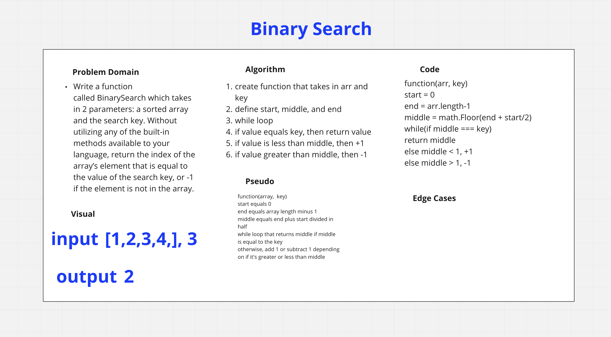

# Binary Search of Sorted Array
Write a function called BinarySearch which takes in 2 parameters: a sorted array and the search key. Without utilizing any of the built-in methods available to your language, return the index of the array’s element that is equal to the value of the search key, or -1 if the element is not in the array.

## Whiteboard Process

## Approach & Efficiency
I defined the start, middle, and end first, then used a while loop.  Next, I divided the array in half and created an if else that would return the middle if it equaled the key and add 1 or subtract 1, depending whether or not the middle was less than or greater than the middle.