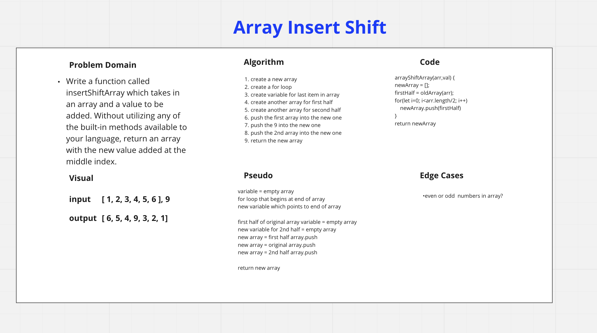

# array-insert-shift.

Middle of an Array
Write a function called insertShiftArray which takes in an array and a value to be added. Without utilizing any of the built-in methods available to your language, return an array with the new value added at the middle index.

## Whiteboard Process

## Approach & Efficiency
I used a similiar technique to the last one, but, instead created a few new arrays to help split the array up.  I then pushed them all into the new array in the proper sequence.  I did this because it made the most logical sense without being able to use methods.
