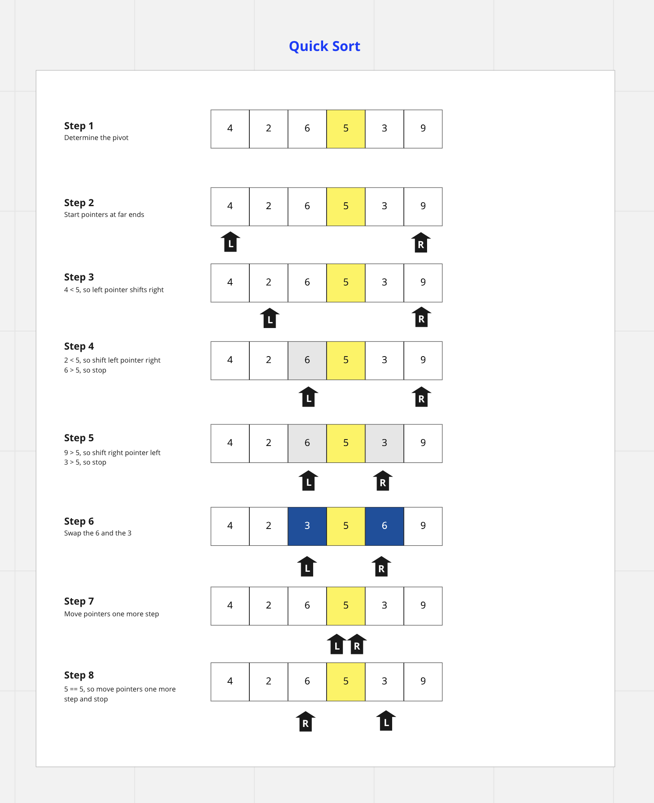

# Quick Sort

**Definition:**
The quick sort algorithm is an in-place sorting algorithm which, like merge sort, uses a divide and conquer technique with the help of recursion.  It was developed in 1959 by a British computer scientist named Tony Hoare.

**How Is It Useful?** 
Still in use today, when implemented well, it can be faster than merge sort and roughly 2 or 3 times faster than headsort.

**How Does It Work?**

The algorithm works in **8 steps** until the entire array is sorted numerically:

1. Determine the pivot

1. Start pointers at far left and far right positions of the array

1. Look through the left half of the array with the left pointer to find a value greater than the pivot, moving from far left to right.  

1. Repeat this step until  a value greater than the pivot is found.

1. Look through the right half of the array with the right pointer to find a value less than the pivot, moving from far right to left.  

1. Repeat this until the less than pivot value is found.

1. Swap with the greater than pivot value found on the left side of the array.

1. Repeat the above steps until 2 pointers both meet or cross

## UML

[Ref](https://www.baeldung.com/cs/quicksort-vs-heapsort)
